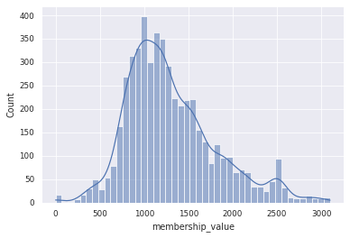
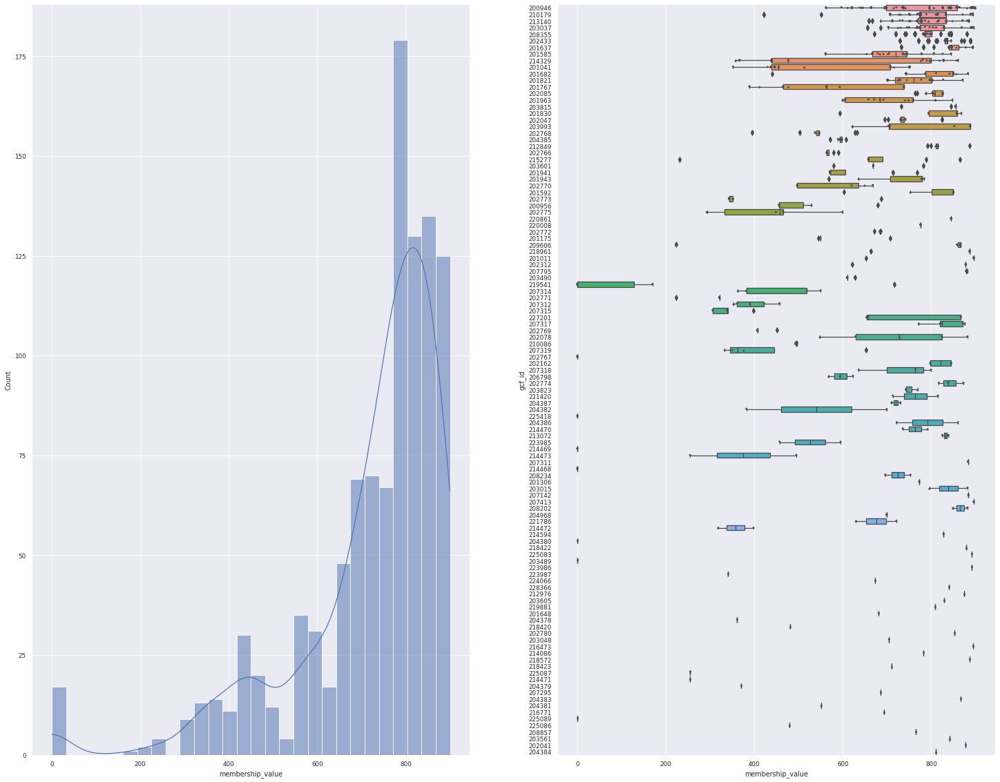
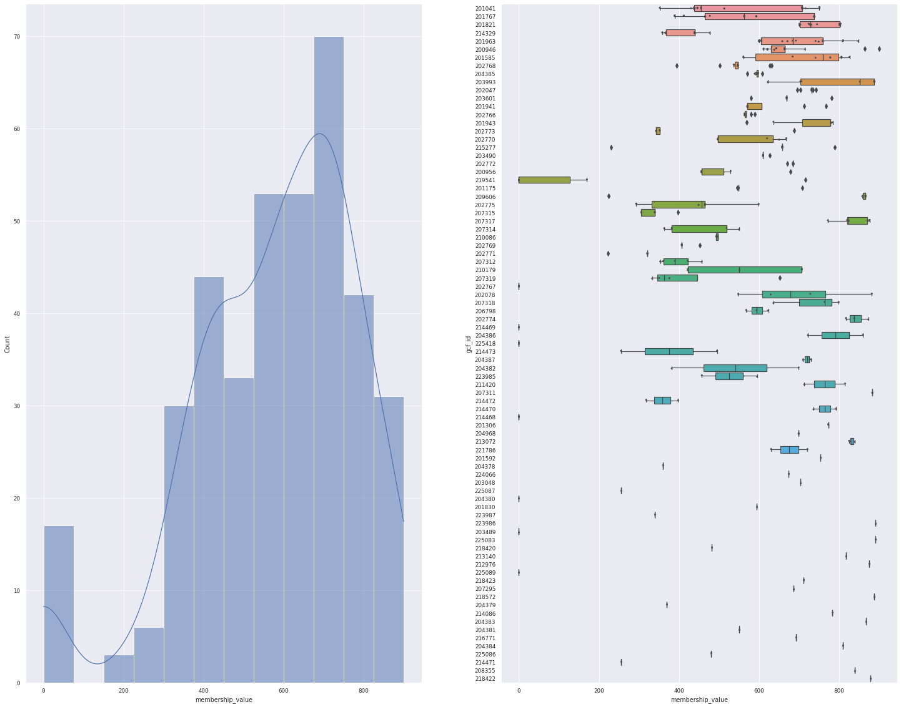

In this episode, we will explore BiG-SLICE query hits of _S. venezuelae_ genomes with the [BiG-FAM database (version 1.0.0, run 6)](https://bigfam.bioinformatics.nl/home). You can download [the `.ipynb` file of this episode](https://github.com/NBChub/bgcflow_tutorial/blob/gh-pages/_episodes/06-bigslice_query-part2.ipynb) and run it from your own directory.

### Table of Contents
1. [BGCflow Paths Configuration](#1)
2. [Raw BiG-SLICE query hits](#2)
3. [A glimpse of the data distribution](#3)
    - [Sanity Check: How many gene clusters predicted by antiSMASH?](#3.1)
    - [How many BGCs can be assigned to BiG-FAM gene cluster families?](#3.2)
    - [A closer look to BiG-FAM distributions](#3.3)
4. [Annotate Network with information from BiG-SCAPE and GTDB](#4)
5. [Import the annotation to Cytoscape](#5)

### Libraries & Functions


```python
# load libraries
import pandas as pd
import seaborn as sns
import matplotlib.pyplot as plt
import networkx as nx
import numpy as np
from pathlib import Path
import json
```


```python
# generate data
def gcf_hits(df_gcf, cutoff=900):
    """
    Filter bigslice result based on distance threshold to model and generate data.
    """
    mask = df_gcf.loc[:, "membership_value"] <= cutoff
    df_gcf_filtered = df_gcf[mask]
    bgcs = df_gcf_filtered.bgc_id.unique()
    gcfs = df_gcf_filtered.gcf_id.unique()
    print(
    f"""BiG-SLICE query with BiG-FAM run 6, distance cutoff {cutoff}
Number of bgc hits : {len(bgcs)}/{len(df_gcf.bgc_id.unique())}
Number of GCF hits : {len(gcfs)}""")
    return df_gcf_filtered

# visualization
def plot_overview(data):
    """
    Plot BGC hits distribution from BiG-SLICE Query
    """
    ranks = data.gcf_id.value_counts().index
    sns.set_theme()
    sns.set_context("paper")
    fig, axes = plt.subplots(1, 2, figsize=(25, 20))
    plt.figure(figsize = (25,25))

    # first plot
    sns.histplot(data=data, x='membership_value', 
                 kde=True, ax=axes[0],)

    # second plot
    sns.boxplot(data=data, y='gcf_id', x='membership_value', 
                orient='h', ax=axes[1], order=ranks)

    # Add in points to show each observation
    sns.stripplot(x="membership_value", y="gcf_id", data=data,
                  jitter=True, size=3, linewidth=0, color=".3", 
                  ax=axes[1], orient='h', order=ranks)
    return
```

## BGCflow Paths Configuration <a name="1"></a>
Customize the cell below to your BGCflow result paths


```python
# interim data
bigslice_query = Path("/datadrive/home/matinnu/bgcflow_data/interim/bigslice/query/s_venezuelae_antismash_6.0.1/")

# processed data
bigslice_query_processed = Path("/datadrive/bgcflow/data/processed/s_venezuelae/bigslice/query_as_6.0.1/")
bigscape_result = Path("/datadrive/home/matinnu/bgcflow_data/processed/s_venezuelae/bigscape/for_cytoscape_antismash_6.0.1/2022-06-21 02_46_35_df_clusters_0.30.csv")
gtdb_table = Path("/datadrive/home/matinnu/bgcflow_data/processed/s_venezuelae/tables/df_gtdb_meta.csv")

# output path
output_path = Path("../tables/bigslice")
output_path.mkdir(parents=True, exist_ok=True)
```

## Raw BiG-SLICE query hits <a name="2"></a>
First, let's see the raw data from BiG-SLICE query hits. We have extracted individual tables from the SQL database.


```python
! tree /datadrive/bgcflow/data/interim/bigslice/query/s_venezuelae_antismash_6.0.1/
```

    /datadrive/bgcflow/data/interim/bigslice/query/s_venezuelae_antismash_6.0.1/
    ├── 1.db
    ├── bgc.csv
    ├── bgc_class.csv
    ├── bgc_features.csv
    ├── cds.csv
    ├── gcf_membership.csv
    ├── hsp.csv
    ├── hsp_alignment.csv
    ├── hsp_subpfam.csv
    ├── schema.csv
    └── sqlite_sequence.csv
    
    0 directories, 11 files


We will first look at these two tables:
- `bgc` table or the file `bgc.csv`
- `gcf_membership` table or the file `gcf_membership.csv`

The data from the interim folder has been processed for downstream analysis in the processed directory:


```python
! tree /datadrive/bgcflow/data/processed/s_venezuelae/bigslice/query_as_6.0.1/
```

    /datadrive/bgcflow/data/processed/s_venezuelae/bigslice/query_as_6.0.1/
    ├── gcf_summary.csv
    ├── gcf_summary.json
    └── query_network.csv
    
    0 directories, 3 files


```python
# load the two tables
df_bgc = pd.read_csv(bigslice_query / "bgc.csv")
# BGC table from bigslice
df_bgc.loc[:, 'genome_id'] = [Path(i).name for i in df_bgc.orig_folder] # will be put in the main bgcflow code
# GCF membership table from bigslice
df_gcf_membership = pd.read_csv(bigslice_query / "gcf_membership.csv")
```

The `gcf_membership` table lists the top 10 closest BiG-FAM GCF models (order shown as `rank` column) and the euclidean distance to the model (`membership_value`). Smaller `membership_value` means that our BGC has a closer or more similar features with the models. Note that we are querying against run 6 in the BiG-FAM model, with threshold of 900, Therefore, if the `membership_value` is above 900, it is less likely that our BGC belongs to that gcf model.


```python
df_gcf_membership.head()
```


<div>
<style scoped>
    .dataframe tbody tr th:only-of-type {
        vertical-align: middle;
    }

    .dataframe tbody tr th {
        vertical-align: top;
    }

    .dataframe thead th {
        text-align: right;
    }
</style>
<table border="1" class="dataframe">
  <thead>
    <tr style="text-align: right;">
      <th></th>
      <th>gcf_id</th>
      <th>bgc_id</th>
      <th>membership_value</th>
      <th>rank</th>
    </tr>
  </thead>
  <tbody>
    <tr>
      <th>0</th>
      <td>203601</td>
      <td>448</td>
      <td>669</td>
      <td>0</td>
    </tr>
    <tr>
      <th>1</th>
      <td>208355</td>
      <td>448</td>
      <td>798</td>
      <td>1</td>
    </tr>
    <tr>
      <th>2</th>
      <td>200946</td>
      <td>448</td>
      <td>826</td>
      <td>2</td>
    </tr>
    <tr>
      <th>3</th>
      <td>207795</td>
      <td>448</td>
      <td>882</td>
      <td>3</td>
    </tr>
    <tr>
      <th>4</th>
      <td>213140</td>
      <td>448</td>
      <td>885</td>
      <td>4</td>
    </tr>
  </tbody>
</table>
</div>


The `bgc_id` column in `gcf_membership` table refers to the `id` column in `bgc` table. Therefore, we can enrich our hits with the metadata contained in `bgc` table


```python
df_bgc.head()
```


<div>
<style scoped>
    .dataframe tbody tr th:only-of-type {
        vertical-align: middle;
    }

    .dataframe tbody tr th {
        vertical-align: top;
    }

    .dataframe thead th {
        text-align: right;
    }
</style>
<table border="1" class="dataframe">
  <thead>
    <tr style="text-align: right;">
      <th></th>
      <th>id</th>
      <th>name</th>
      <th>type</th>
      <th>on_contig_edge</th>
      <th>length_nt</th>
      <th>orig_folder</th>
      <th>orig_filename</th>
      <th>genome_id</th>
    </tr>
  </thead>
  <tbody>
    <tr>
      <th>0</th>
      <td>1</td>
      <td>data/interim/bgcs/s_venezuelae/6.0.1/GCF_00863...</td>
      <td>as6</td>
      <td>0</td>
      <td>29650</td>
      <td>data/interim/bgcs/s_venezuelae/6.0.1/GCF_00863...</td>
      <td>NZ_CP029197.1.region004.gbk</td>
      <td>GCF_008639165.1</td>
    </tr>
    <tr>
      <th>1</th>
      <td>2</td>
      <td>data/interim/bgcs/s_venezuelae/6.0.1/GCF_00870...</td>
      <td>as6</td>
      <td>0</td>
      <td>11401</td>
      <td>data/interim/bgcs/s_venezuelae/6.0.1/GCF_00870...</td>
      <td>NZ_CP029195.1.region011.gbk</td>
      <td>GCF_008705255.1</td>
    </tr>
    <tr>
      <th>2</th>
      <td>3</td>
      <td>data/interim/bgcs/s_venezuelae/6.0.1/GCF_00025...</td>
      <td>as6</td>
      <td>0</td>
      <td>10390</td>
      <td>data/interim/bgcs/s_venezuelae/6.0.1/GCF_00025...</td>
      <td>NC_018750.1.region027.gbk</td>
      <td>GCF_000253235.1</td>
    </tr>
    <tr>
      <th>3</th>
      <td>4</td>
      <td>data/interim/bgcs/s_venezuelae/6.0.1/GCF_02104...</td>
      <td>as6</td>
      <td>0</td>
      <td>25706</td>
      <td>data/interim/bgcs/s_venezuelae/6.0.1/GCF_02104...</td>
      <td>NZ_JAJNOJ010000002.1.region009.gbk</td>
      <td>GCF_021044745.1</td>
    </tr>
    <tr>
      <th>4</th>
      <td>5</td>
      <td>data/interim/bgcs/s_venezuelae/6.0.1/GCF_00929...</td>
      <td>as6</td>
      <td>0</td>
      <td>20390</td>
      <td>data/interim/bgcs/s_venezuelae/6.0.1/GCF_00929...</td>
      <td>NZ_CP023693.1.region020.gbk</td>
      <td>GCF_009299385.1</td>
    </tr>
  </tbody>
</table>
</div>


## A glimpse of the data distribution <a name="3"></a>
### Sanity Check: How many gene clusters predicted by antiSMASH? <a name="3.1"></a>


```python
print(f"There are {len(df_bgc)} BGCs predicted from {len(df_bgc.orig_folder.unique())} genomes.")
```

    There are 515 BGCs predicted from 18 genomes.


### How many BGCs can be assigned to BiG-FAM gene cluster families? <a name="3.2"></a>
BiG-SLICE calculate the feature distance of a BGC to BiG-FAM models (which is a centroid of each Gene Cluster Families generated from 1.2 million BGCs). Though it's not that accurate, it can give us a glimpse of the distribution of our BGCs within the database.


```python
sns.set_theme()
sns.set_context("paper")
sns.histplot(df_gcf_membership, x='membership_value', kde=True)
for c in [900, 1200, 1500]:
    gcf_hits(df_gcf_membership, c)
```

    BiG-SLICE query with BiG-FAM run 6, distance cutoff 900
    Number of bgc hits : 382/515
    Number of GCF hits : 114
    BiG-SLICE query with BiG-FAM run 6, distance cutoff 1200
    Number of bgc hits : 487/515
    Number of GCF hits : 220
    BiG-SLICE query with BiG-FAM run 6, distance cutoff 1500
    Number of bgc hits : 504/515
    Number of GCF hits : 351


    

    


Depending on the distance cutoffs, we can assign our BGCs to a different numbers of GCF model. The default cutoffs is 900 (run 6). In our data, 382 out of 515 BGCs can be assigned to 114 BiG-FAM GCF. Do note that the number of assigned GCF can be smaller if we only consider the first hit (the query returns 10 hits).

Smaller number means a closer distance to the GCF model. For further analysis, we will stick with the default cutoff.

### A closer look to BiG-FAM distributions <a name="3.3"></a>
BGCflow already cleans the data for downstream processing. The processed bigslice query can be found in `bgcflow/data/processed/s_venezuelae/bigslice/query_as_6.0.1/`.


```python
data = pd.read_csv(bigslice_query_processed / "query_network.csv")
plot_overview(data)
```


    

    


    <Figure size 1800x1800 with 0 Axes>


On the figure above, we can see the distance distribution of our query to the model, and how each models have varying degree of distances. But, this data includes the top 10 hits, so 1 BGCs can be assigned to multiple GCFs.

Let's see again only for the first hit.


```python
n_hits = 1 # get only the first hit
n_hits_only = data.loc[:, "rank"].isin(np.arange(n_hits))
data_1 = data[n_hits_only]
print(f"For the top {n_hits} hit, {len(data_1.bgc_id.unique())} BGCs can be mapped to {len(data_1.gcf_id.unique())} GCF")
plot_overview(data_1)
```

    For the top 1 hit, 382 BGCs can be mapped to 83 GCF


    

    


    <Figure size 1800x1800 with 0 Axes>


## Annotate Network with information from BiG-SCAPE and GTDB <a name="4"></a>
These network will only be meaningful when we enrich it with metadata. We can use information from our BiG-SCAPE runs, taxonomic information from GTDB-tk, and other tables generated by BGCflow. 


```python
# Enrich with BiG-SCAPE
df_annotation = pd.read_csv(bigscape_result, index_col=0)
df_annotation.loc[:, "bigslice_query"] = "query"
for i in data["gcf_id"].unique():
    df_annotation.loc[i, "bigslice_query"] = "model"

# enrich with GTDB
df_gtdb = pd.read_csv(gtdb_table).set_index("genome_id")
for i in df_annotation.index:
    genome_id = df_annotation.loc[i, "genome_id"]
    if type(genome_id) == str:
        for item in ["gtdb_release", "Domain", "Phylum", "Class", "Order", "Family", "Genus", "Species", "Organism"]:
            df_annotation.loc[i, item] = df_gtdb.loc[genome_id, item]

# enrich with bgc info - will be put in the main bgcflow code
bgc_info = df_bgc.copy()
bgc_info["bgc_id"] = [str(i).replace(".gbk", "") for i in bgc_info["orig_filename"]]
bgc_info = bgc_info.set_index("bgc_id")
for i in df_annotation.index:
    try:
        df_annotation.loc[i, "on_contig_edge"] = bgc_info.loc[i, "on_contig_edge"]
        df_annotation.loc[i, "length_nt"] = bgc_info.loc[i, "length_nt"]
    except KeyError:
        pass
```


```python
df_annotation.head()
```


<div>
<style scoped>
    .dataframe tbody tr th:only-of-type {
        vertical-align: middle;
    }

    .dataframe tbody tr th {
        vertical-align: top;
    }

    .dataframe thead th {
        text-align: right;
    }
</style>
<table border="1" class="dataframe">
  <thead>
    <tr style="text-align: right;">
      <th></th>
      <th>product</th>
      <th>bigscape_class</th>
      <th>genome_id</th>
      <th>accn_id</th>
      <th>gcf_0.30</th>
      <th>gcf_0.40</th>
      <th>gcf_0.50</th>
      <th>Clan Number</th>
      <th>fam_id_0.30</th>
      <th>fam_type_0.30</th>
      <th>...</th>
      <th>Domain</th>
      <th>Phylum</th>
      <th>Class</th>
      <th>Order</th>
      <th>Family</th>
      <th>Genus</th>
      <th>Species</th>
      <th>Organism</th>
      <th>on_contig_edge</th>
      <th>length_nt</th>
    </tr>
  </thead>
  <tbody>
    <tr>
      <th>NC_018750.1.region001</th>
      <td>ectoine</td>
      <td>Others</td>
      <td>GCF_000253235.1</td>
      <td>NC_018750.1</td>
      <td>1911.0</td>
      <td>1911.0</td>
      <td>1911.0</td>
      <td>2045.0</td>
      <td>2.0</td>
      <td>known_family</td>
      <td>...</td>
      <td>d__Bacteria</td>
      <td>p__Actinobacteriota</td>
      <td>c__Actinomycetia</td>
      <td>o__Streptomycetales</td>
      <td>f__Streptomycetaceae</td>
      <td>g__Streptomyces</td>
      <td>venezuelae</td>
      <td>s__Streptomyces venezuelae</td>
      <td>0.0</td>
      <td>10417.0</td>
    </tr>
    <tr>
      <th>NC_018750.1.region002</th>
      <td>terpene</td>
      <td>Terpene</td>
      <td>GCF_000253235.1</td>
      <td>NC_018750.1</td>
      <td>2109.0</td>
      <td>2109.0</td>
      <td>2109.0</td>
      <td>NaN</td>
      <td>14.0</td>
      <td>unknown_family</td>
      <td>...</td>
      <td>d__Bacteria</td>
      <td>p__Actinobacteriota</td>
      <td>c__Actinomycetia</td>
      <td>o__Streptomycetales</td>
      <td>f__Streptomycetaceae</td>
      <td>g__Streptomyces</td>
      <td>venezuelae</td>
      <td>s__Streptomyces venezuelae</td>
      <td>0.0</td>
      <td>20954.0</td>
    </tr>
    <tr>
      <th>NC_018750.1.region003</th>
      <td>T3PKS.NRPS.NRPS-like.T1PKS</td>
      <td>PKS-NRP_Hybrids</td>
      <td>GCF_000253235.1</td>
      <td>NC_018750.1</td>
      <td>1913.0</td>
      <td>1913.0</td>
      <td>1913.0</td>
      <td>NaN</td>
      <td>22.0</td>
      <td>known_family</td>
      <td>...</td>
      <td>d__Bacteria</td>
      <td>p__Actinobacteriota</td>
      <td>c__Actinomycetia</td>
      <td>o__Streptomycetales</td>
      <td>f__Streptomycetaceae</td>
      <td>g__Streptomyces</td>
      <td>venezuelae</td>
      <td>s__Streptomyces venezuelae</td>
      <td>0.0</td>
      <td>99490.0</td>
    </tr>
    <tr>
      <th>NC_018750.1.region004</th>
      <td>terpene.lanthipeptide-class-ii</td>
      <td>Others</td>
      <td>GCF_000253235.1</td>
      <td>NC_018750.1</td>
      <td>2111.0</td>
      <td>2111.0</td>
      <td>2111.0</td>
      <td>36.0</td>
      <td>20.0</td>
      <td>unknown_family</td>
      <td>...</td>
      <td>d__Bacteria</td>
      <td>p__Actinobacteriota</td>
      <td>c__Actinomycetia</td>
      <td>o__Streptomycetales</td>
      <td>f__Streptomycetaceae</td>
      <td>g__Streptomyces</td>
      <td>venezuelae</td>
      <td>s__Streptomyces venezuelae</td>
      <td>0.0</td>
      <td>29652.0</td>
    </tr>
    <tr>
      <th>NC_018750.1.region005</th>
      <td>lanthipeptide-class-iv</td>
      <td>RiPPs</td>
      <td>GCF_000253235.1</td>
      <td>NC_018750.1</td>
      <td>2399.0</td>
      <td>2399.0</td>
      <td>2399.0</td>
      <td>552.0</td>
      <td>17.0</td>
      <td>known_family</td>
      <td>...</td>
      <td>d__Bacteria</td>
      <td>p__Actinobacteriota</td>
      <td>c__Actinomycetia</td>
      <td>o__Streptomycetales</td>
      <td>f__Streptomycetaceae</td>
      <td>g__Streptomyces</td>
      <td>venezuelae</td>
      <td>s__Streptomyces venezuelae</td>
      <td>0.0</td>
      <td>22853.0</td>
    </tr>
  </tbody>
</table>
<p>5 rows × 23 columns</p>
</div>


```python
df_annotation.to_csv("../tables/bigslice/enriched_query_annotation.csv")
```

## Import the annotation to Cytoscape <a name="5"></a>
Download the `enriched_query_annotation.csv` and import it to enrich the nodes in Cytoscape network.
Using the new annotations, play around and explore the network to find interesting BGCs and their BiG-FAM models.
